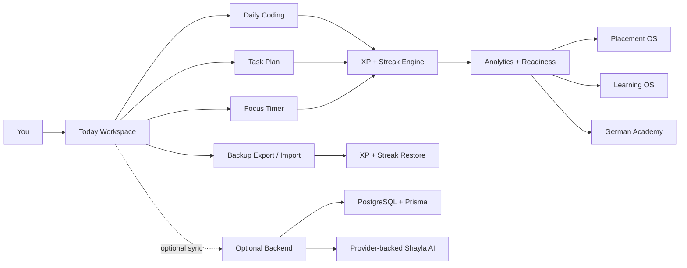

# SanzzOS

<p align="center">
  
</p>

<h3 align="center">Sanju Career OS - a local-first career command center for placements, coding practice, learning, projects, and focused daily execution.</h3>

<p align="center">
  <a href="https://github.com/Sanjay190806/Career_OS"></a>
  <a href="docs/LOCAL_MODE.md"></a>
  <a href="docs/OFFLINE_MODE.md"></a>
  <a href="LICENSE"></a>
</p>

<p align="center">
  <a href="https://react.dev"></a>
  <a href="https://www.typescriptlang.org"></a>
  <a href="https://vitejs.dev"></a>
  <a href="https://expressjs.com"></a>
  <a href="https://www.prisma.io"></a>
  <a href="https://www.postgresql.org"></a>
  <a href="https://github.com/pmndrs/zustand"></a>
</p>

---

## Snapshot

SanzzOS is a personal productivity and placement preparation system built around one idea: your career data should be useful every day without forcing you into a cloud account first. The app runs locally, stores core tracker data in the browser, and can optionally use the backend, PostgreSQL, and provider-backed AI features when you configure them.

The project roadmap is now complete through **v2.2**, including the daily coding reset and backup import restore fixes.

| Area | What it does |
| --- | --- |
| Today Workspace | Daily tasks, focus sessions, energy mode planning, streaks, XP, and quick execution loops. |
| Daily Coding | CodeChef Java and SkillRack daily targets with shared Today state, XP rules, and LeetCode scheduling. |
| Placement OS | Company tracking, applications, interviews, resumes, online assessments, and readiness views. |
| Learning OS | Structured learning paths, skill progress, notes, milestones, and analytics. |
| German Academy | Local German study workspace with lessons, vocabulary, practice, and review flow. |
| Shayla AI | Optional AI mentor/chat layer through the backend when provider keys are configured. |
| Backup System | Export/import support designed to restore XP, streaks, and coding state reliably. |
| Portfolio Mode | Recruiter-safe public/demo surface that avoids exposing private local data. |

---

## v2.2 Milestone Board

| Version | Status | Focus |
| --- | --- | --- |
| v2.2 | Complete | Daily coding reset, CodeChef/SkillRack Today state, LeetCode start-date logic, XP cap rules, and backup import XP/streak restore reliability. |
| v2.1 | Complete | Backup/snapshot stability, local-first sync hardening, dashboard resilience, and safer restore behavior. |
| v2.0 | Complete | Career OS workspace foundation: Today, Placement OS, Learning OS, German Academy, analytics, portfolio, and AI-assisted planning. |
| v1.7.x | Stable base | Local-first fallback behavior, backend/database guardrails, and offline-ready shell. |

### v2.2 Daily Coding Rules

- CodeChef Java: 5 problems per day.
- SkillRack: 5 problems per day.
- LeetCode: scheduled to become active on August 1, 2026.
- Active DSA XP: reset for the new plan and capped at 125 XP per active day.
- Today Workspace: daily coding progress appears in the same daily execution surface.
- Backup Import: restored backups rehydrate XP, streaks, and coding progress instead of only importing raw data.

---

## How SanzzOS Thinks



The frontend is the main daily driver. The backend adds optional account/snapshot/database and AI proxy features. If the backend or database is not running, the local tracker can still be useful.

---

## Tech Stack

| Layer | Tools |
| --- | --- |
| Frontend | React 18, TypeScript, Vite, Tailwind CSS |
| State | Zustand with persisted local stores |
| Backend | Node.js, Express, TypeScript |
| Database | PostgreSQL, Prisma |
| Desktop/local tooling | Windows batch scripts, Docker Compose, npm workspaces |
| Offline support | PWA manifest, service worker, local-first fallback docs |
| AI | Backend-proxied provider support when configured; tracker remains usable without keys |

---

## Quick Start

### 1. Clone the repo

```powershell
git clone https://github.com/Sanjay190806/Career_OS.git
cd Career_OS
```

### 2. Install dependencies

```powershell
npm install
```

If PowerShell blocks npm scripts on Windows, use:

```powershell
cmd /c npm install
```

### 3. Start the app

Fast path:

```powershell
.\Start-Sanzz-OS.bat
```

Manual path:

```powershell
cmd /c npm run dev:all
```

Typical local URLs:

| Service | URL |
| --- | --- |
| Frontend | `http://localhost:5173` |
| Backend API | `http://localhost:3001` |

PostgreSQL/backend setup is mainly needed for account, cloud/snapshot, database, or backend AI features. For pure local tracking, the frontend can still carry the main workflow.

---

## Full Local Setup

### Start PostgreSQL

```powershell
cmd /c npm run db:up
```

### Configure backend env

```powershell
cd backend
copy .env.example .env
```

Update `backend/.env` only with your own local values. Keep real secrets out of git.

### Initialize Prisma

```powershell
cd backend
npx prisma validate
npx prisma generate
npx prisma migrate dev --name init
npm run prisma:seed
```

---

## Environment

| Variable | Required | Notes |
| --- | --- | --- |
| `DATABASE_URL` | For backend database features | PostgreSQL connection string used by Prisma. |
| `JWT_SECRET` | For auth/session features | Use a strong local secret. |
| `GROQ_API_KEY` or provider key | Optional | Enables provider-backed Shayla AI. |
| Frontend API URL vars | Optional | Only needed when changing default local API routing. |

Use the example files as templates:

- [backend/.env.example](backend/.env.example)
- [frontend/.env.example](frontend/.env.example)

---

## Useful Commands

| Command | Purpose |
| --- | --- |
| `cmd /c npm run dev:all` | Start frontend and backend together. |
| `cmd /c npm run dev:frontend` | Start only the Vite frontend. |
| `cmd /c npm run dev:backend` | Start only the Express backend. |
| `cmd /c npm run build` | Build the project. |
| `cmd /c npm run test` | Run test suites. |
| `cmd /c npm run check:all` | Run broader validation checks. |
| `cmd /c npm run prisma:validate` | Validate Prisma schema. |
| `cmd /c npm run db:up` | Start local PostgreSQL through Docker Compose. |
| `cmd /c npm run db:down` | Stop local PostgreSQL. |

---

## Project Map

```text
SanzzOS/
|-- backend/                  Express API, Prisma, auth, sync, AI proxy
|-- data/                     Shared datasets and roadmap content
|-- docs/                     Setup, local mode, offline mode, architecture notes
|-- electron/                 Desktop app wrapper work
|-- frontend/                 React + Vite client
|   |-- public/               PWA manifest, icons, offline shell
|   `-- src/                  Components, stores, routing, feature modules
|-- Start-Sanzz-OS.bat        Windows one-click starter
|-- Stop-Sanzz-OS.bat         Windows helper to stop local processes
|-- docker-compose.yml        Local PostgreSQL service
`-- package.json              Workspace scripts
```

---

## Backup and Restore

SanzzOS treats backups as more than a file download. A restored backup should bring back the daily operating state you care about:

- XP totals
- Streak state
- Daily coding progress
- Today Workspace progress
- learning and placement data
- local-first user settings

The v2.2 restore work specifically protects against the bug where imported backup data existed but XP/streak state did not fully rehydrate in the live app session.

---

## Privacy Model

- Local tracker data stays on your machine by default.
- `.env` files are ignored and should never be committed.
- Public/demo/portfolio surfaces should use safe sample data, not private application notes.
- Provider-backed AI is optional and only works when configured through backend secrets.
- The app remains useful without AI keys.

---

## Documentation

| Guide | Link |
| --- | --- |
| Setup | [docs/SETUP.md](docs/SETUP.md) |
| Local mode | [docs/LOCAL_MODE.md](docs/LOCAL_MODE.md) |
| Offline mode | [docs/OFFLINE_MODE.md](docs/OFFLINE_MODE.md) |
| Architecture | [docs/ARCHITECTURE.md](docs/ARCHITECTURE.md) |
| Testing | [docs/TESTING.md](docs/TESTING.md) |
| Changelog | [CHANGELOG.md](CHANGELOG.md) |

---

## Development Notes

This repo is optimized for direct local iteration:

1. Run the app locally.
2. Make a focused feature change.
3. Verify the exact workflow in the browser.
4. Run the relevant build/test command.
5. Commit only the files related to that change.

For Windows, `cmd /c npm ...` is often the most reliable way to avoid PowerShell execution policy friction.

---

## Roadmap After v2.2

- Improve visual QA for mobile dashboards.
- Add stronger backup diff previews before import.
- Expand recruiter-safe portfolio exports.
- Continue tightening AI command preview/apply flows.
- Add more focused tests around daily XP, streaks, and import migrations.

---

## License

This project is released under the [MIT License](LICENSE).

---

## Credits

Built by **Sanjay** as a personal career operating system: practical, local-first, privacy-aware, and designed around real daily progress.
