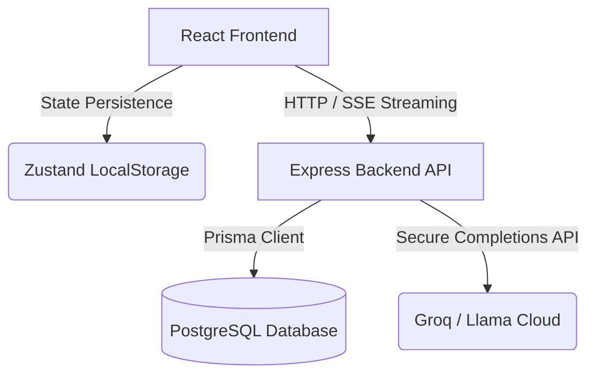

# Technical Architecture Overview

Sanju Career OS uses a modern full-stack web structure split into client-first interface renders and server backend proxies.

## Tech Stack
- **Frontend**: React, TypeScript, Vite, Tailwind CSS, Zustand persistence middleware
- **Backend**: Express API, Node, Zod validations, Prisma ORM
- **Database**: PostgreSQL (Docker-based)
- **AI Core**: Groq AI Llama-3 API completions
